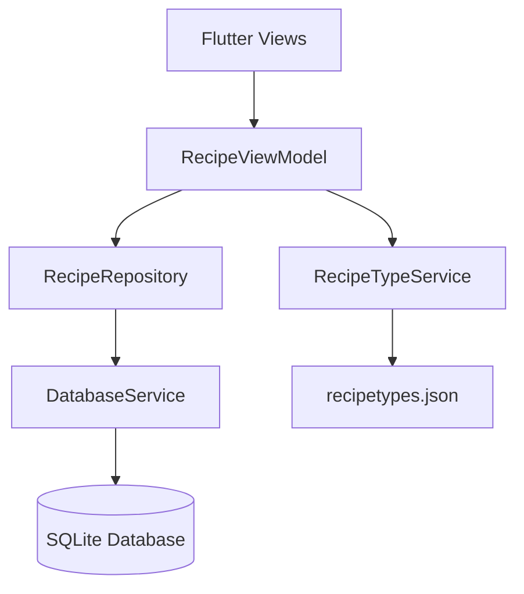
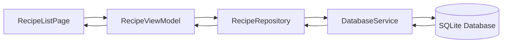
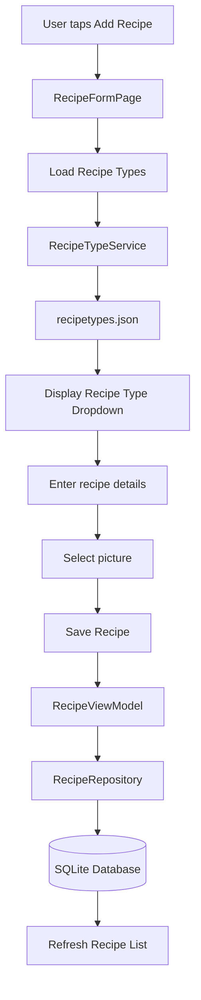
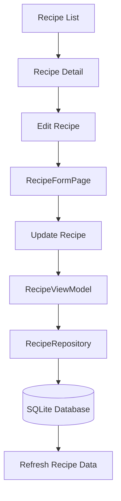
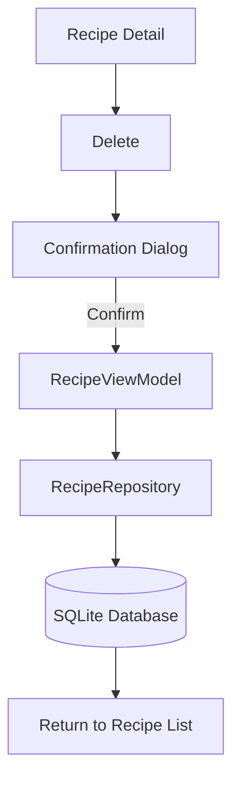
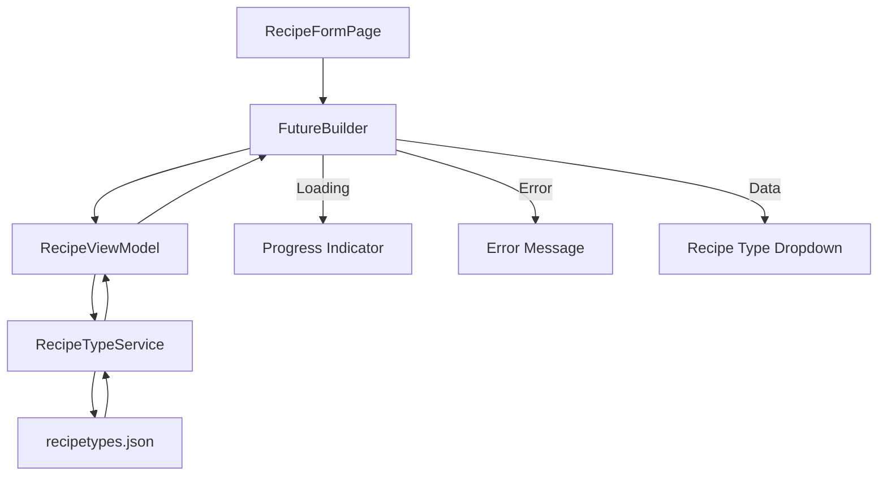
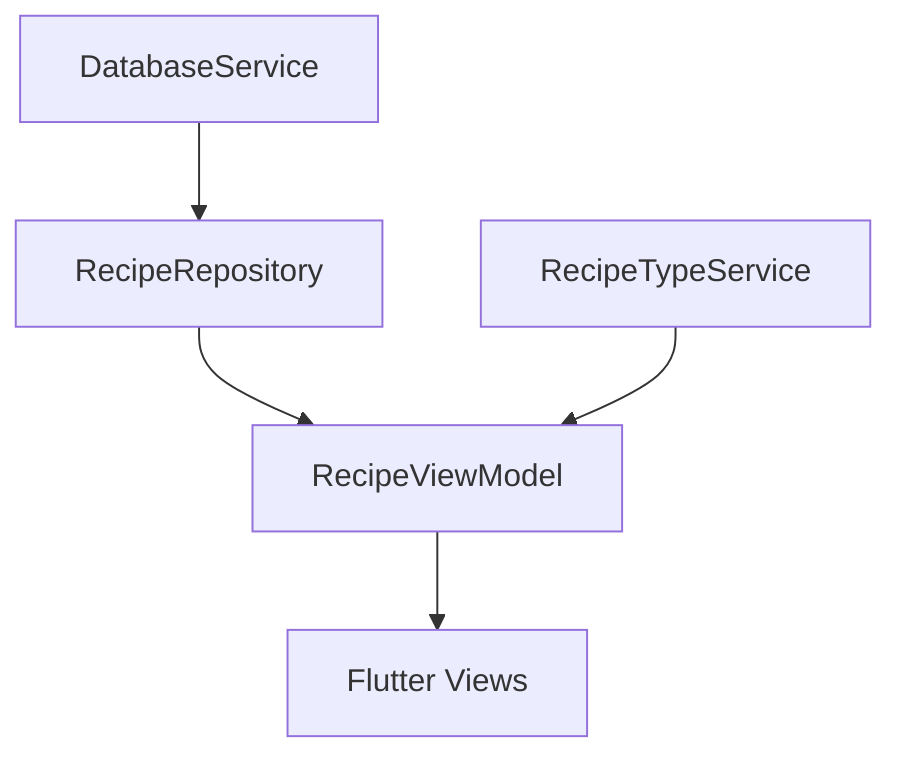

# Recipe Box

A small Flutter app for keeping your own cookbook on your phone.

You can browse a list of recipes, filter them by meal type, open a recipe to view its ingredients and steps, and add, edit or delete your own recipes — including a photo from your gallery.

Everything is stored locally in a SQLite database on the device, so the app works fully offline and does not require a backend or account.

The app ships with six sample recipes:

* Nasi Lemak
* Pancakes
* Chicken Rice
* Fried Rice
* Spaghetti Bolognese
* Chocolate Cake

These recipes are seeded the first time the database is created.

## Features

* **Recipe list** — View all saved recipes, newest first, with their meal type.
* **Filter by type** — Filter recipes by Breakfast, Lunch, Dinner or Dessert, or show all recipes.
* **Recipe detail** — View the recipe photo, ingredients and numbered cooking steps.
* **Add / edit** — Create or update recipes with validation for the recipe name, type, ingredients and steps.
* **Photos** — Select a recipe image from the device gallery.
* **Delete** — Delete recipes with a confirmation dialog.
* **Local persistence** — Recipe data is stored in SQLite and remains available after restarting the app.
* **Offline operation** — No backend or network connection is required.

## Technology Stack

| Technology         | Purpose                   |
| ------------------ | ------------------------- |
| Dart               | Programming language      |
| Flutter            | Application framework     |
| Provider           | State management          |
| MVVM               | Application architecture  |
| SQLite / `sqflite` | Local data persistence    |
| `image_picker`     | Selecting recipe photos   |
| JSON               | Recipe type configuration |

## Architecture

The app follows an **MVVM architecture** with a repository and service layer.



### Layers

#### Views

The UI layer is responsible for displaying data and handling user interaction.

* `RecipeListPage`
* `RecipeDetailPage`
* `RecipeFormPage`

#### ViewModel

`RecipeViewModel` manages application state and coordinates between the views and data layers.

Responsibilities include:

* Loading recipes
* Filtering recipes
* Adding recipes
* Updating recipes
* Deleting recipes
* Loading recipe types
* Managing loading and error states
* Notifying the UI when state changes

#### Repository

`RecipeRepository` provides an abstraction over the database layer.

Responsibilities include:

* Fetching recipes
* Fetching a recipe by ID
* Inserting recipes
* Updating recipes
* Deleting recipes
* Converting between database records and Dart models

#### Services

`DatabaseService` manages SQLite setup, schema creation and sample-data seeding.

`RecipeTypeService` loads and parses recipe types from the bundled JSON asset.

## Application Flow

### Loading the Recipe List



### Adding a Recipe



### Editing a Recipe



### Deleting a Recipe



## Reactive Programming

The app demonstrates asynchronous reactive UI handling using Flutter's `FutureBuilder`.

Recipe types are loaded asynchronously from `assets/recipetypes.json`.



The recipe-type Future is created once when the form is initialized and reused during widget rebuilds.

## State Management

`Provider` is used to expose `RecipeViewModel` to the widget tree.

```text
ChangeNotifierProvider
        ↓
RecipeViewModel
        ↓
Flutter Views
```

`RecipeViewModel` extends `ChangeNotifier` and calls `notifyListeners()` when relevant application state changes.

## Dependency Injection

Dependencies are supplied through constructors rather than being instantiated directly inside the ViewModel.



This keeps the ViewModel independent from concrete service creation and provides a foundation for easier testing and replacement of dependencies.

## Persistence

Recipe information is stored locally using SQLite.

Database:

```text
recipe_box.db
```

### Database Schema

Recipes are stored in a single `recipes` table:

| Column           | Type    | Notes                                     |
| ---------------- | ------- | ----------------------------------------- |
| `id`             | INTEGER | Primary key, autoincrement                |
| `title`          | TEXT    | Recipe name                               |
| `recipe_type_id` | INTEGER | Refers to an ID in `recipetypes.json`     |
| `image_path`     | TEXT    | File path of the selected photo, nullable |
| `ingredients`    | TEXT    | JSON-encoded list of strings              |
| `steps`          | TEXT    | JSON-encoded list of strings              |

Ingredients and steps are stored as JSON strings in SQLite and converted back into `List<String>` when retrieved.

### Recipe Types

Meal types are not stored in the database.

They are loaded from:

```text
assets/recipetypes.json
```

Current recipe types:

```json
[
  {
    "id": 1,
    "name": "Breakfast"
  },
  {
    "id": 2,
    "name": "Lunch"
  },
  {
    "id": 3,
    "name": "Dinner"
  },
  {
    "id": 4,
    "name": "Dessert"
  }
]
```

To add another meal type, add a corresponding entry to `recipetypes.json`.

## Image Handling

Recipe images are selected using the `image_picker` package.

The selected image path is stored with the recipe rather than storing the image binary data directly in SQLite.

For iOS, the required photo library permission description is configured in `ios/Runner/Info.plist`.

## Project Structure

```text
lib/
├── main.dart
│
├── models/
│   ├── recipe.dart
│   └── recipe_type.dart
│
├── services/
│   ├── database_services.dart
│   └── recipe_type_service.dart
│
├── repositories/
│   └── recipe_repository.dart
│
├── viewmodels/
│   └── recipe_view_model.dart
│
└── views/
    ├── recipe_list_page.dart
    ├── recipe_detail_page.dart
    └── recipe_form_page.dart

assets/
└── recipetypes.json
```

## Supported Platforms

The application currently uses `sqflite` for local storage, with the intended supported platforms being:

* Android
* iOS
* macOS

The `web/`, `windows/` and `linux/` directories are present because they are included by the Flutter project template. The current SQLite implementation is not configured for those platforms.

## Requirements

* **Flutter SDK 3.10.3** or newer
* Dart SDK `>=3.0.3 <4.0.0`
* Xcode for iOS/macOS development
* Android Studio and Android SDK for Android development
* A connected device or running emulator/simulator

Check your Flutter setup with:

```bash
flutter doctor
```

## Getting Started

### 1. Clone the repository

```bash
git clone https://github.com/farhanazman387/recipe_box.git
cd recipe_box
```

### 2. Install dependencies

```bash
flutter pub get
```

### 3. Run the app

List the devices Flutter can see:

```bash
flutter devices
```

Then run:

```bash
flutter run
```

To target a specific device:

```bash
flutter run -d <device-id>
```

On first launch, the app creates `recipe_box.db` in the application's database directory and seeds it with the sample recipes.

To start over with a fresh database, uninstall the app from the device or clear its application data and run the app again.

## Building a Release

Android:

```bash
flutter build apk
```

iOS:

```bash
flutter build ios
```

iOS builds require the appropriate signing configuration in Xcode.

## Code Quality

Run the Dart and Flutter analyzer with:

```bash
flutter analyze
```

The project is formatted using Dart's standard formatter:

```bash
dart format .
```

## Tests

Run the test suite with:

```bash
flutter test
```

Unit and widget tests are planned as a further improvement.

> Note: The current `test/widget_test.dart` is still the default counter smoke test generated by the Flutter project template and does not represent the Recipe Box application. It should be replaced with application-specific tests before relying on the test suite as part of the assessment.

## Assessment Requirement Coverage

| Requirement                           | Status                  |
| ------------------------------------- | ----------------------- |
| Dart                                  | ✅                       |
| Flutter                               | ✅                       |
| SQLite / Hive storage                 | ✅ SQLite                |
| Recipe type JSON                      | ✅                       |
| Pre-populated recipes                 | ✅                       |
| Recipe list                           | ✅                       |
| Filter by recipe type                 | ✅                       |
| Create recipe                         | ✅                       |
| Recipe picture                        | ✅                       |
| Ingredients                           | ✅                       |
| Steps                                 | ✅                       |
| Recipe detail                         | ✅                       |
| Update recipe                         | ✅                       |
| Delete recipe                         | ✅                       |
| Persistent data                       | ✅                       |
| Material Design                       | ✅                       |
| Different screen sizes / orientations | ✅ Tested                |
| MVVM / Provider                       | ✅                       |
| Reactive Programming                  | ✅ `FutureBuilder`       |
| Dependency Injection                  | ✅ Constructor injection |
| Unit / UI Tests                       | Planned                 |
| Networking API                        | Not implemented         |
| Authentication / encryption           | Not implemented         |

## Dependencies

| Package           | Used for                                   |
| ----------------- | ------------------------------------------ |
| `sqflite`         | Local SQLite storage                       |
| `path`            | Building the database file path            |
| `provider`        | Providing `RecipeViewModel` to the widgets |
| `image_picker`    | Selecting a recipe photo from the gallery  |
| `cupertino_icons` | iOS-style icons                            |

## Future Improvements

Possible future improvements include:

* Unit tests
* Widget/UI tests
* Networking/API integration
* Authentication and session management
* Additional recipe metadata
* Improved image storage and caching
* More advanced filtering and search

## Author

Developed as part of a hands-on Flutter mobile development assessment.
